# Foldera

A native macOS file manager that looks and works like the Windows 11 File Explorer: tabs, a breadcrumb address bar, a command bar, a navigation pane and a Details pane, with Mac keyboard shortcuts (⌘). Built with Swift, SwiftUI and AppKit only.

<picture>
  <source media="(prefers-color-scheme: dark)" srcset="docs/images/hero-dark.png">
  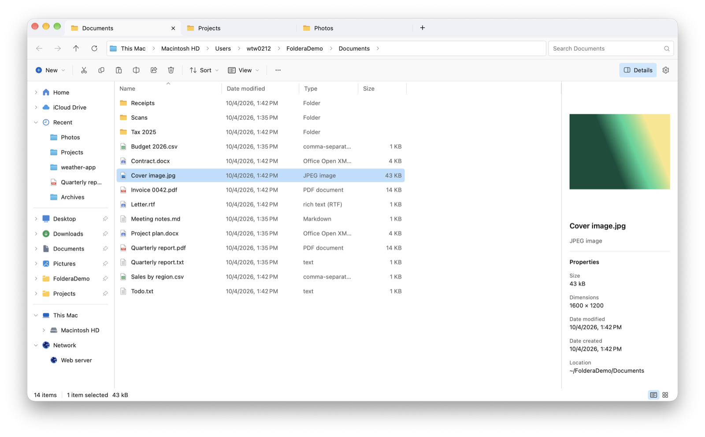
</picture>

**Highlights**

- Tabs, breadcrumbs, back/forward history and an address bar that also runs commands
- Eight layouts, saved folder sort and columns, thumbnails, a Details pane with live preview, Quick Look and recursive search with scope and metadata filters
- Copy and move with progress, conflict handling and undo; Finder-style bulk rename
- Extract and create zip, 7z and more, and browse archives without extracting them
- Optional dual pane, with SFTP servers opening in normal tabs
- English and Traditional Chinese

## Install

Build a disk image (needs Xcode and XcodeGen, see [Build from source](#build-from-source)):

```bash
./scripts/make-dmg.sh
```

This writes `dist/Foldera-<version>.dmg`. Open it and drag Foldera to Applications. When you first launch the installed copy, Foldera ejects its installer image if nothing is using it.

Then give Foldera **Full Disk Access** once, so it can open folders macOS protects (Mail, Safari and so on): Foldera ▸ Settings ▸ Access ▸ **Open Privacy & Security Settings**, and drag Foldera into the Full Disk Access list, or click **+** and pick `/Applications/Foldera.app`. macOS never adds apps to that list by itself.

The disk image is signed with your development certificate, so it runs on your own Macs. To share it with others, see [Signing](#signing).

## Browsing

**Tabs and breadcrumbs.** Click through folders, jump back with the breadcrumb, and middle-click a folder to open it in a background tab. Tabs can be dragged to reorder; middle-click a tab to close it.

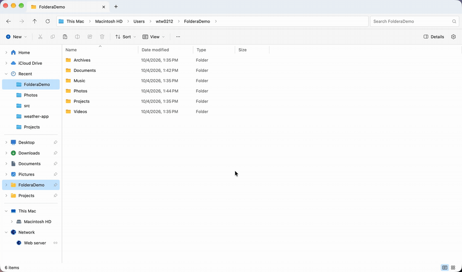

**Layouts.** Eight layouts from Details to Extra large icons (⌥⌘1–8, or ⌘+ / ⌘−, ⌘-scroll, pinch), remembered per folder. Images and videos show thumbnails, and the Details pane (⌥⌘P) previews the selection.

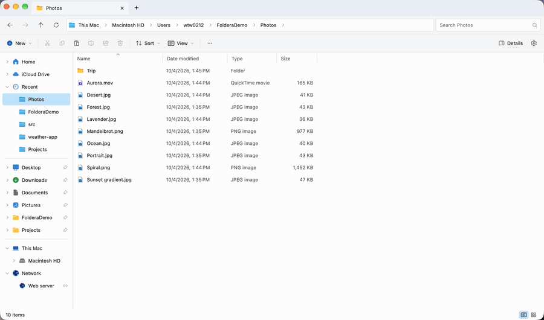

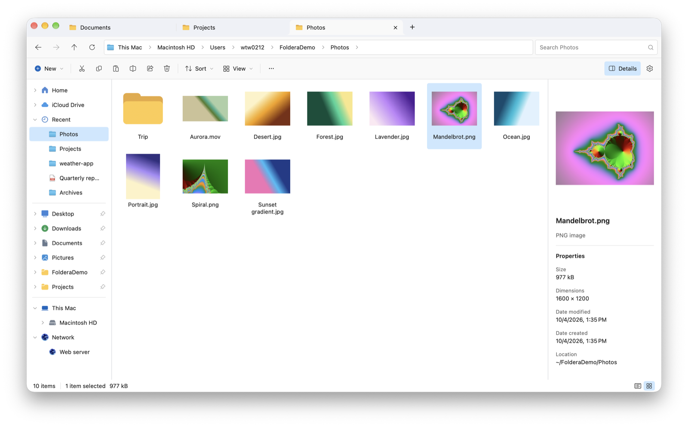

**Recent items.** The navigation pane's **Recent** section lists the folders and files you opened last, newest first; items that were deleted or moved are skipped. It shows 5 by default (Settings ▸ General ▸ Recent items in navigation pane: 3–20, or None). Right-click an item to remove it, or the section to clear it.

**Quick access.** Drag a folder onto the edge of a pin, or onto the dividers between pins, to pin it there; dropping on the middle of a pin moves or copies into that folder.

**Cloud drives.** OneDrive, Google Drive, Dropbox and Box folders in `~/Library/CloudStorage` appear in the navigation pane on their own. Settings ▸ Cloud (or right-click a cloud drive ▸ Add cloud drive) adds any other synced or network folder.

**Removable drives.** Right-click a drive in This Mac or the navigation pane and choose **Eject**. Foldera stays responsive while macOS finishes, then shows **You can safely remove the device** until you dismiss it or mount another drive. If the device is busy, Foldera says so, so you can close files on it and try again.

## Working with files

Copy and move show a progress window with Explorer-style conflict handling, and can be undone (⌘Z). The cancellable **Preparing…** stage measures the files before byte progress starts. Drag items onto folders, breadcrumbs or the navigation pane: the same drive moves, another drive copies; hold ⌥ to copy or ⌘ to move.

Use the search box's **Search options** to search this folder or include subfolders, and filter by Type, Date modified and Size. Filters also work with an empty search box. Searches stop at 10,000 matches and show a notice when that limit is reached. Server folders, archives and Recent filter their current listing.

**View → Columns** chooses the columns in Details. Drag a header to reorder or resize it; each folder remembers its sort order, visible columns, order and widths.

**Bulk rename.** Select several items and press F2 for Finder-style Replace / Add / Format renaming with a live preview.

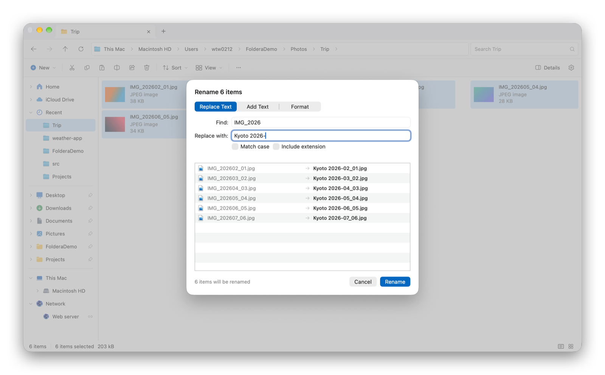

**Dual pane** (⌥⌘D) puts two folders side by side. F5 copies and F6 moves the selection to the other pane.

## Archives

Right-click an archive to **Extract here**, **Extract to “name”** or **Extract each to separate folders**. The command bar's **Extract** asks for a folder, with options to extract into a new folder and to open the result when done. Extraction never overwrites existing items, shows progress with Cancel, and asks for the password of encrypted archives. Foldera reads zip, 7z, rar (including RAR5), split archives, tar.gz/bz2/xz, iso and cab.

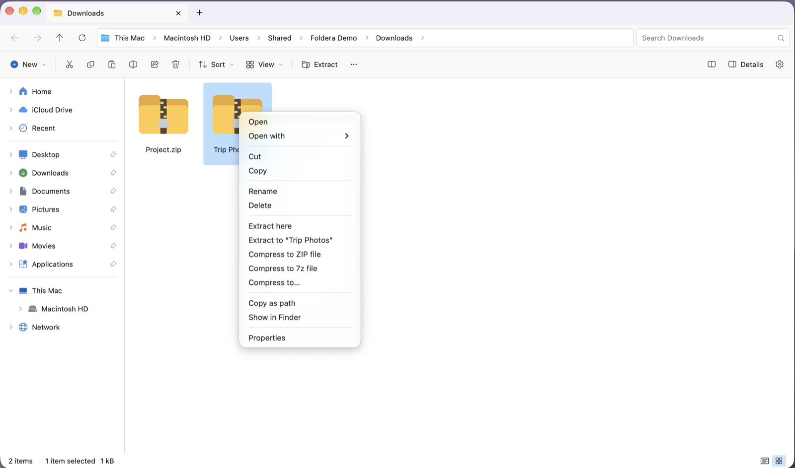

**Browse archives without extracting them.** Double-click a zip, 7z, rar, iso, cab or tar to open it in its own window, titled “(archive)”. Folders inside open like any other; files open from a temporary copy; pictures, PDFs and videos get thumbnails, Details previews and Quick Look. Copy, drag out (to Finder or another Foldera window) or **Extract** to take items out; nothing inside can be changed. You can also type a path through an archive into the address bar, such as `~/Downloads/Trip Photos.7z/Trip Photos`. Archives with encrypted file names ask for the password before opening. tar.gz and similar two-layer archives are extracted instead.

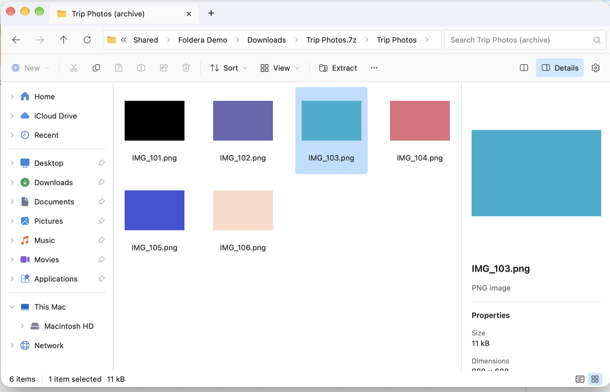

**Compress.** Right-click anything to **Compress to ZIP file** or **Compress to 7z file**, or choose **Compress to…** to set the name, folder, format, compression level and an optional password: AES-256 or ZipCrypto for zip, and 7z can also encrypt file names. Passwords go to 7-Zip privately and are never saved.

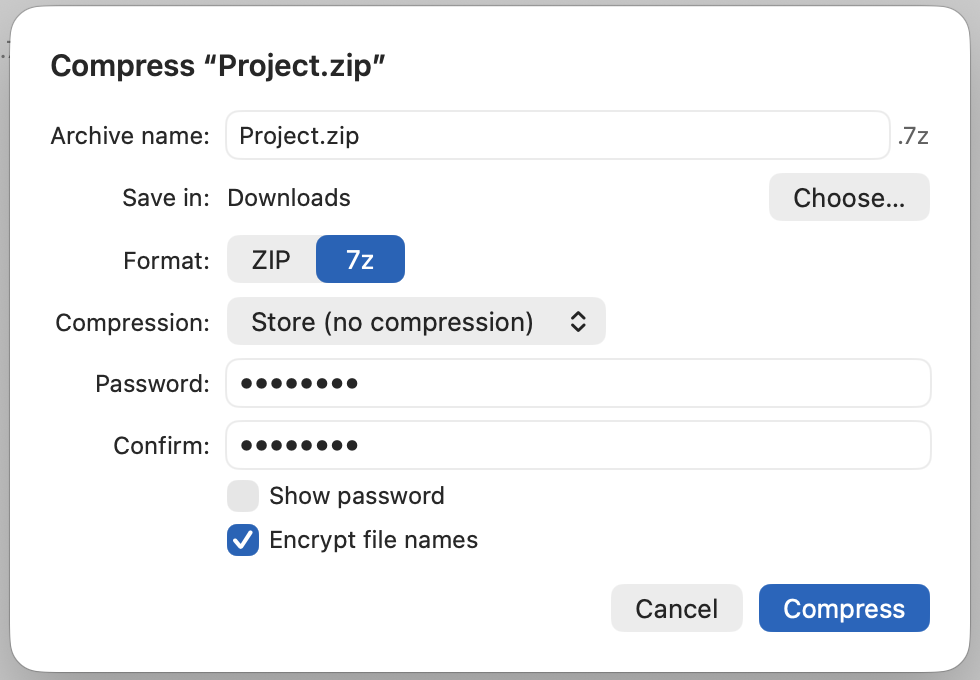

Foldera bundles the unmodified 7-Zip console program (`7zz`) and runs it as a separate process. tar archives use the system `tar`, and single-item ZIPs use `ditto`, like Finder.

## Network and SFTP

**Network** (⇧⌘K, or the navigation pane) lists saved SFTP sites, mounted network drives and file servers on the local network. **Connect to Server** (⌘K) mounts `smb://`, `afp://`, `nfs://` and WebDAV addresses with macOS's own sign-in, like Finder, and opens `sftp://user@host[:port]/path` in Foldera. The address bar accepts the same addresses.

SFTP folders open in normal tabs, so dual pane gives a WinSCP-style local/remote layout:

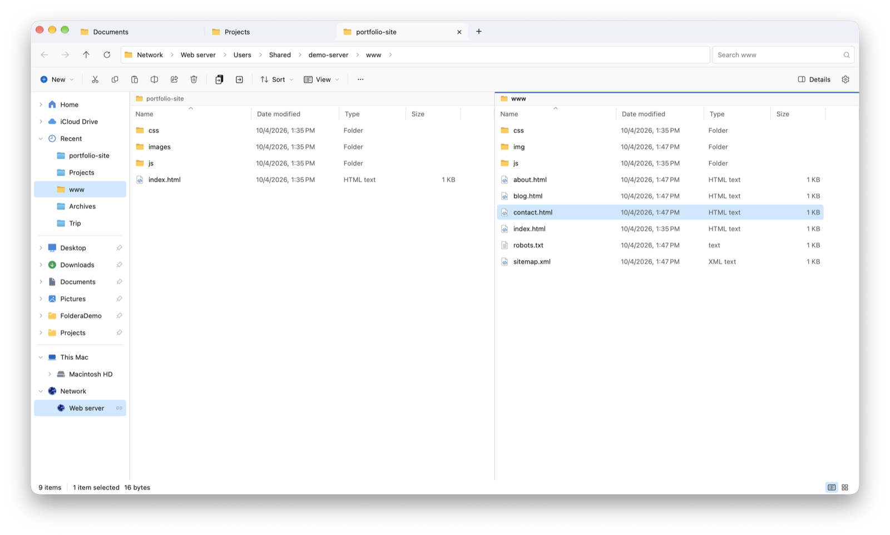

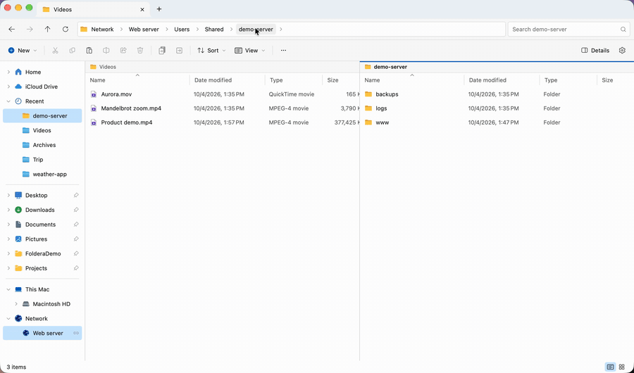

- Browse, filter the current folder, rename, delete (permanently, after confirming), and create folders and text files.
- Drag, or copy and paste, between local and server panes to upload and download, with progress and conflict handling. Moves within one server are renames.
- Copies leave out directory symlinks; a move that would leave one out stops before removing its source. If a copy succeeds but deleting the source fails, the complete copy is kept and the source is taken off Cut, so a retry can't destroy anything.
- Opening a server file downloads a private editing copy into its app, and each save uploads it again. **File ▸ Server Files ▸ Finish Editing Server Files** uploads the last save and removes synchronized copies. Quitting removes synchronized copies too; unsent edits stay in Application Support. After reopening Foldera, choose **Resume Recovered Edits** to reopen them and resume uploading, or **Show Server Files** to get a copy by hand.
- **Open in Terminal (SSH)** opens an `ssh` session in the current server folder.

Sites sign in with a password or an Ed25519/RSA private key in OpenSSH format. Passwords and key passphrases are kept in the macOS Keychain, never in preferences. The first connection shows the server's SHA-256 key fingerprint to confirm, and a changed key is reported before anything is sent. Server changes can't be undone, and Quick Look, thumbnails and archive commands work on local files only.

## Address bar

The address bar takes paths (absolute, `~`, or relative such as `Documents` and `../dist`), server addresses and commands:

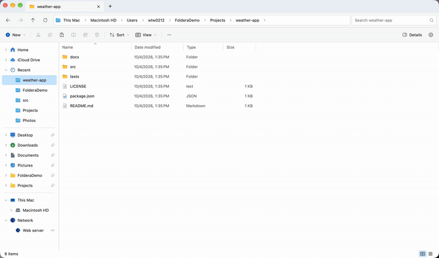

| Type | Does |
|---|---|
| `terminal`, `zsh`, `bash` … | Opens the terminal (Settings ▸ General) in the current folder |
| `git status`, `ls -la` | Runs the command in Terminal, in the current folder |
| `code`, `cursor`, `zed`, `subl`, `xed` | Opens the folder in that editor (`code README.md` opens a file) |
| `finder`, `open .` | Shows the folder in Finder |
| an app name (`safari`) | Launches the app |
| `https://…`, `smb://server/share`, `sftp://…` | Opens the link, connects to the share, or opens the server |
| `~/Downloads/Photos.zip/Photos` | Opens a folder inside an archive |

## Keyboard

| Action | Shortcut |
|---|---|
| Open | Return, ⌘↓ |
| Rename (several items: bulk rename) | F2 |
| Up one level | ⌘↑ |
| Back / Forward | ⌫ or ⌘[ / ⌘] |
| Move to Trash | ⌘⌫ |
| Cut / Copy / Paste | ⌘X / ⌘C / ⌘V |
| Undo / Redo | ⌘Z / ⇧⌘Z |
| New folder | ⇧⌘N |
| New tab / Close tab | ⌘T / ⌘W |
| Next / previous tab | ⇧⌘] / ⇧⌘[, ⌘1–9 |
| Edit address | ⌘L |
| Search | ⌘F |
| Refresh | ⌘R |
| Show hidden items | ⇧⌘. |
| Properties (Get Info) | ⌘I |
| Quick Look | Space |
| Layouts (Extra large icons … Content) | ⌥⌘1–8 |
| Bigger / smaller layout | ⌘+ / ⌘−, ⌘-scroll, pinch |
| Details pane (with preview) | ⌥⌘P |
| Dual pane on/off | ⌥⌘D |
| Copy / move selection to other pane | F5 / F6 |
| Network / Connect to Server | ⇧⌘K / ⌘K |
| Open folder in background tab / close tab | Middle-click a folder / a tab |

## Languages

Settings ▸ General ▸ Language switches between **Follow System**, **English** and **繁體中文** immediately and remembers your choice. Unsupported system languages fall back to English. File names, paths and shortcuts never change; macOS-owned dialogs and file-type descriptions use the system language.

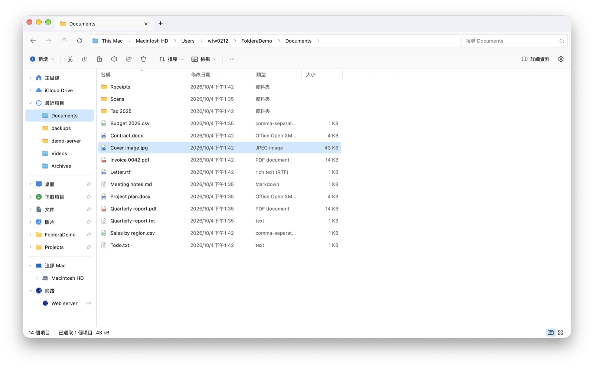

Translations live in `Foldera/Resources/<language>.lproj` (`Localizable.strings`, `Localizable.stringsdict` for plurals, and `InfoPlist.strings` for privacy prompts). To add a language, copy those files and translate them, add a case to `AppLanguage` and a region to `project.yml`, then regenerate the project.

## Build from source

Requires Xcode 26+ and [XcodeGen](https://github.com/yonaskolb/XcodeGen) (`brew install xcodegen`).

```bash
xcodegen generate
open Foldera.xcodeproj
```

Or from the command line:

```bash
xcodebuild -project Foldera.xcodeproj -scheme Foldera -derivedDataPath build.noindex/debug build
open build.noindex/debug/Build/Products/Debug/Foldera.app
```

`Foldera.xcodeproj` is generated from `project.yml`: edit `project.yml`, not the project file.

### Signing

Put your Apple development team in `Config/Local.xcconfig` (not committed):

```
DEVELOPMENT_TEAM = ABCDE12345
```

A stable signature matters: macOS ties folder permissions and Full Disk Access to it, so with ad-hoc signing every rebuild looks like a new app and asks for access again.

To share the disk image with other people, set `SIGN_IDENTITY` to a Developer ID certificate and `NOTARY_PROFILE` to a notarytool profile before running `make-dmg.sh` (see the script's header).

### Tests and CI

```bash
bash scripts/test.sh unit  # Swift Testing: unit and real-filesystem integration tests, with coverage
bash scripts/test.sh ui    # XCTest: native UI smoke tests (needs a logged-in macOS desktop)
python3 -m unittest discover -s scripts/tests -v  # CI runner, coverage gate and packaging tests
```

Both macOS commands generate the project and sign ad hoc, so no Apple Developer account is needed. The `Testing` configuration gives the app its own bundle identifier and preferences. Tests use disposable folders, named pasteboards and isolated UserDefaults; the volume tests mount disposable APFS/FAT disk images, so run them on a Mac with `hdiutil`, not in a restricted sandbox.

Each run keeps its log, `.xcresult`, summary and (for unit tests) `xccov` JSON in `build.noindex/test-results/<unit|ui>/run.*`; open the result bundle in Xcode to inspect failures, coverage and UI screenshots. Extra filters pass through, for example `bash scripts/test.sh unit -only-testing:FolderaTests/BrowserTabTests`; focused runs can fall below the coverage gate.

CI runs on every pull request, push to `main` and manual run. It checks workflows with actionlint, shell scripts with ShellCheck and the Python tooling, then runs the unit and UI tests on Apple Silicon with macOS 26. Every test must pass without skips, and line coverage across the **whole app** (Model, Services, Views, Theme and App; no files excluded) must be above 80%. The **CI passed** check fails if any required job fails, is cancelled or is skipped, and can be required in branch protection. Results are kept for 14 days.

The UI tests cover address and history navigation, recursive search, tab shortcuts, creating folders with undo, Traditional Chinese and connecting to SFTP, against a throwaway key-only OpenSSH server on 127.0.0.1 that the tests start themselves. Appearance, real cloud-provider accounts and macOS permission prompts still need checking by hand.

### Project layout

| Path | Contents |
|---|---|
| `Foldera/App` | App entry point and menu bar commands |
| `Foldera/Model` | Window and tab state, navigation history, settings, sidebar locations |
| `Foldera/Services` | File operations, transfers, archives, clipboard, FSEvents directory watcher |
| `Foldera/Network` | Network page, SFTP client, server editing |
| `Foldera/Views` | Tab strip, address bar, command bar, navigation pane, sheets |
| `Foldera/Views/FileList` | List and icon views, context menus |
| `Foldera/Theme` | Windows 11 colors and icons |
| `ThirdParty` | Bundled 7-Zip, vendored swift-nio-ssh, icon license |

### App icon

The icon is drawn in code by `scripts/make-icon.swift`:

```bash
swift scripts/make-icon.swift /tmp/icon-1024.png
```

Then resize it into `Foldera/Resources/Assets.xcassets/AppIcon.appiconset` (16–1024 px, for example with `sips -z`).

## Credits

Interface icons are [Fluent UI System Icons](https://github.com/microsoft/fluentui-system-icons) by Microsoft, under the MIT License (see `ThirdParty/FluentUI-System-Icons-LICENSE.txt`).

Archive extraction and 7z creation use [7-Zip](https://www.7-zip.org/) by Igor Pavlov (unmodified `7zz` 26.03), under the GNU LGPL 2.1 with the unRAR restriction plus BSD parts (see `ThirdParty/7-Zip/7-Zip-License.txt`, also inside the app).

SFTP uses [Citadel](https://github.com/orlandos-nl/Citadel) 0.12.0 (MIT), pinned because 0.12.1 replaced its SSH dependency with an unvetted fork. Its SSH layer, [swift-nio-ssh](https://github.com/Joannis/swift-nio-ssh) 0.3.5 (Apache 2.0), is vendored in `ThirdParty/swift-nio-ssh` with a small patch so RSA keys sign in with SHA-2 as RFC 8332 specifies (see `PATCHES.md` there).
